<div align="center">

<a href="https://wespify.com">
  
</a>

<br/>


[](https://wespify.com)
[](mailto:github@wespify.com)
[](#)
[](#-gpg---list-keys)

</div>

---

<div align="center">
  

  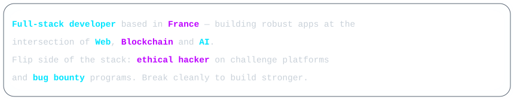

  
</div>

---

<div align="center">
  

  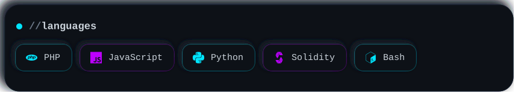
  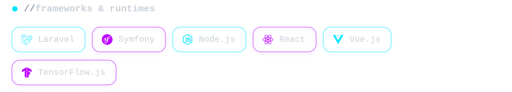
  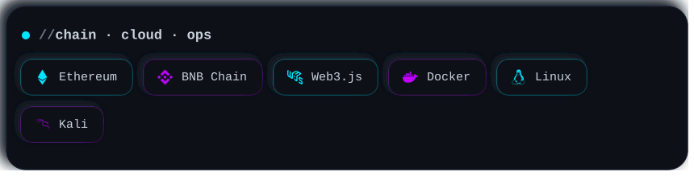
  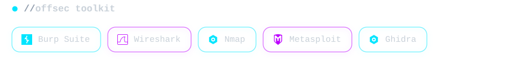
</div>

---

<div align="center">
  
</div>

<table>
<tr>
<td width="50%" valign="top">

#### 🎵 [php-discogs-api](https://github.com/keyamasabaya/php-discogs-api)

PHP 8.x client for the Discogs API — direct access to the world's largest music database.

`PHP 8.x` · `REST` · `OAuth`


</td>
<td width="50%" valign="top">

#### 💰 [php-bscscan-api](https://github.com/keyamasabaya/php-bscscan-api)

API client for the BSC blockchain explorer — real-time DeFi data extraction.

`PHP` · `Web3` · `Blockchain`


</td>
</tr>
<tr>
<td width="50%" valign="top">

#### 🤖 [realtime-object-detection](https://github.com/keyamasabaya/realtime-object-detection)

Real-time object detection on mobile using TensorFlow.js and the COCO-SSD model.

`JavaScript` · `TensorFlow.js` · `COCO-SSD`


</td>
<td width="50%" valign="top">

#### 🔮 What's next?

Got an idea, a need, a technical challenge? Let's talk.

[](mailto:github@wespify.com)

</td>
</tr>
</table>

---

<div align="center">
  

  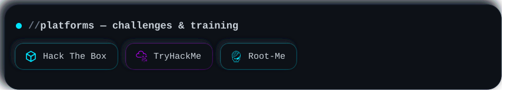
  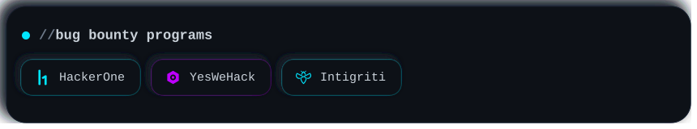

  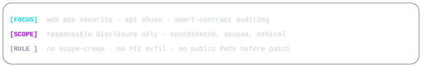

  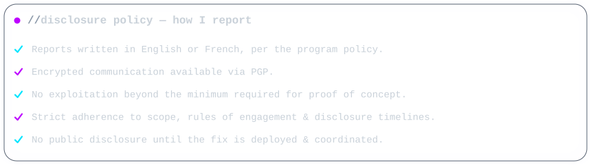
</div>

---

<div align="center">
  

  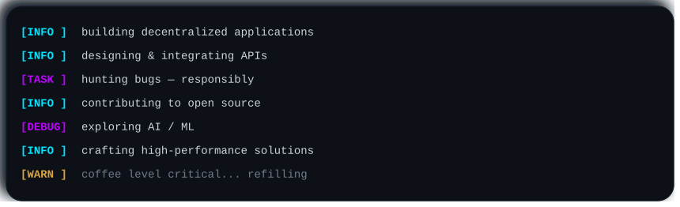
</div>

---

<div align="center">
  

  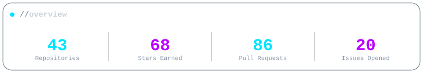

  

  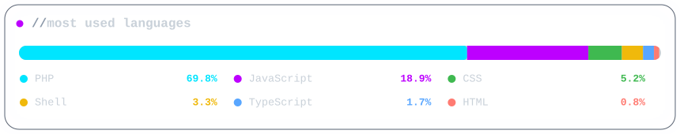

</div>

---

<div align="center">
  

<details>
<summary></summary>

<br/>

```
pub   rsa4096 2025-11-14 [SC]
uid   w3spi5 <github@wespify.com>
sub   rsa4096 2025-11-14 [E]
```

```
-----BEGIN PGP PUBLIC KEY BLOCK-----

mDMEaReKGxYJKwYBBAHaRw8BAQdAP69WrJF2dKEn24eWMiiU2YLoXQE177zbzKkV
wzA6qO+0J2dpdGh1Yi53ZXNwaWZ5LmNvbSA8Z2l0aHViQHdlc3BpZnkuY29tPoiZ
BBMWCgBBFiEEoLY7VKDTPAb/6hIZhA2KpJiwURgFAmkXihsCGwMFCT4SZ+UFCwkI
BwICIgIGFQoJCAsCBBYCAwECHgcCF4AACgkQhA2KpJiwURi2EwD/RfKGV4ulJ7kp
GbLQDRfTfwuInO9aaGJQMQs6JsBWZGoA/3/UCcbNCUTxtpm+f0qu/yIbJsuTi81K
hsgfSYE0kdAFuDgEaReKGxIKKwYBBAGXVQEFAQEHQEMwYakHNplpdqxioB1yP42p
911AKgHvK7ZM3UI2DWBOAwEIB4h+BBgWCgAmFiEEoLY7VKDTPAb/6hIZhA2KpJiw
URgFAmkXihsCGwwFCT4SZ+UACgkQhA2KpJiwURj6QQEAtY1V+yx7jWZcHLztg96v
VKvyluRaziIGyVEi+ie2WZcA/1RbR5g5yjD47R2Bl990mPmi4U3l2UjjVD+L8/Dv
VGAA
=E4ac
-----END PGP PUBLIC KEY BLOCK-----
```

</details>

</div>

---

<div align="center">

```ansi
╔══════════════════════════════════════════════════════════════╗
║   "Code is like humor.                                       ║
║    When you have to explain it, it's bad."   — Cory House    ║
╚══════════════════════════════════════════════════════════════╝
```

**Thanks for stopping by. Explore the repos, drop me a line, let's build (or break) something.**

<a href="https://github.com/keyamasabaya">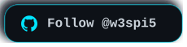</a>
<a href="mailto:github@wespify.com"></a>

<br/>


</div>
